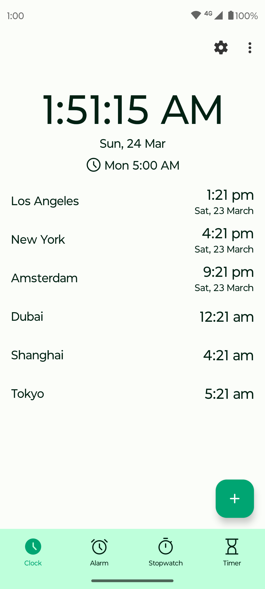
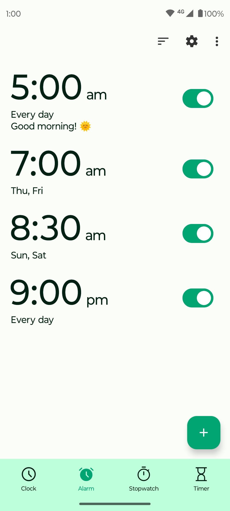
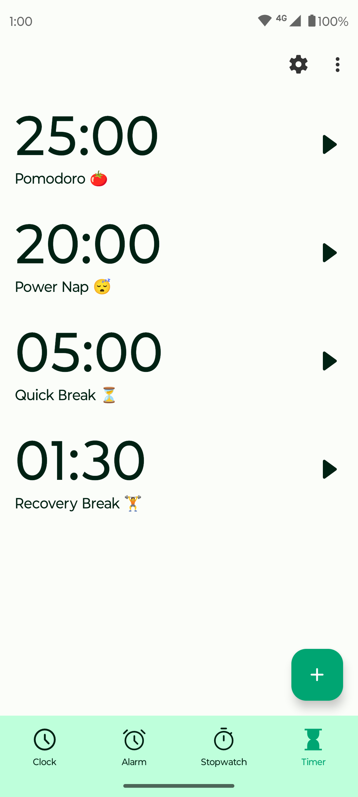

# Fossify Clock

Introducing Fossify Clock – the ultimate timekeeping companion designed to enhance your daily routines and promote better sleep habits. With a multitude of functions tailored to your needs, Fossify Clock seamlessly integrates into your life, offering unparalleled convenience and versatility.

**⌚ MULTIFUNCTIONAL TIMEKEEPING:**  
Experience the power of versatile time management with Fossify Clock. From serving as a clock widget to functioning as an alarm clock and stopwatch, this app is your go-to tool for regulating your daily activities and improving your overall lifestyle.

**⏰ FEATURE-RICH ALARM:**  
Wake up refreshed with Fossify Clock's comprehensive alarm features. Set multiple alarms with options like day selection, vibration toggle, custom labels and ringtone customization. Enjoy gradual volume increase and a customizable snooze button for a pleasant waking experience. With a user-friendly interface, setting up alarms has never been easier.

**⏱️ CONVENIENT STOPWATCH:**  
Track your activities with precision using Fossify Clock's stopwatch function. Measure longer periods or individual laps effortlessly. You can also sort your laps in ascending or descending order.

**⏳ PRECISE TIMER FUNCTIONALITY:**  
Stay on top of your tasks with Fossify Clock's versatile timer feature. Customize ringtone preferences, toggle vibrations, and pause countdowns to suit your needs. Whether you're timing cooking intervals, managing study sessions, or ensuring timely breaks, Fossify Clock has you covered with precision and ease.

**🌈 CLOCK WIDGET WITH CUSTOMIZABLE FEATURES:**  
Transform your home screen with Fossify Clock's customizable clock widget. Adjust text color, background color, and transparency. Choose between analog or digital clock to suit your style and easily access essential time information at a glance.

**🎨 CUSTOMIZABLE INTERFACE AND THEMES:**  
Enjoy a personalized experience with Fossify Clock's material design and dark theme options. Tailor the app to your preferences with customizable colors and themes, enhancing usability and reducing eye strain, especially in low-light environments.

**🔒 PRIVACY-FIRST APPROACH:**  
Rest assured knowing your privacy is protected with Fossify Clock's offline operation. Experience maximum privacy, security, and stability without sacrificing functionality or convenience.

**🌐 AD-FREE & OPEN-SOURCE:**  
Say goodbye to intrusive ads and unnecessary permissions. Fossify Clock is ad-free, fully open-source, and grants you complete control over your timekeeping experience.

Upgrade your time management skills, optimize your routines, and prioritize better sleep with Fossify Clock. Download now and take control of your time like never before.

➡️ Explore more Fossify apps: https://www.fossify.org 
➡️ Open-Source Code: https://www.github.com/FossifyOrg 
➡️ Join the community on Reddit: https://www.reddit.com/r/Fossify 
➡️ Connect on Telegram: https://t.me/Fossify

